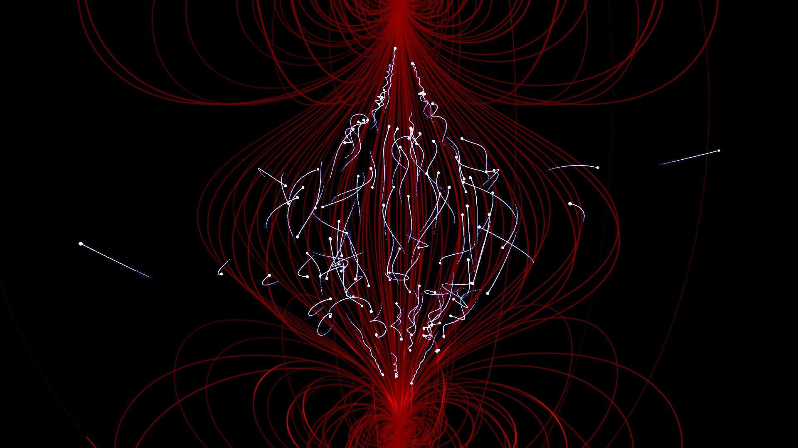

# Magnetic Bottle Simulation

Simulate particles inside a constant magnetic feld. 

## Structure

- `code/main.py`: Classes with methods to do the simulation
- `code/utils.py`: Utility functions.
- `code/plot_utils.py`: Utility functions for plotting.
- `code/magnetic_dipole.ipynb`: Notebook with an example simulation. 

## How to Use

Use the `code/magnetic_dipole.ipynb` notebook as a reference. 

## Requirements

Numpy, matplotlip and numba

## Aknowledgments

I used this notebook for reference: https://uio-ccse.github.io/computational-essay-showroom/essays/exercises/essayseeds/MagneticBottle_Numpy.html

## License

Distributed under the MIT License. See `LICENSE` for more information.